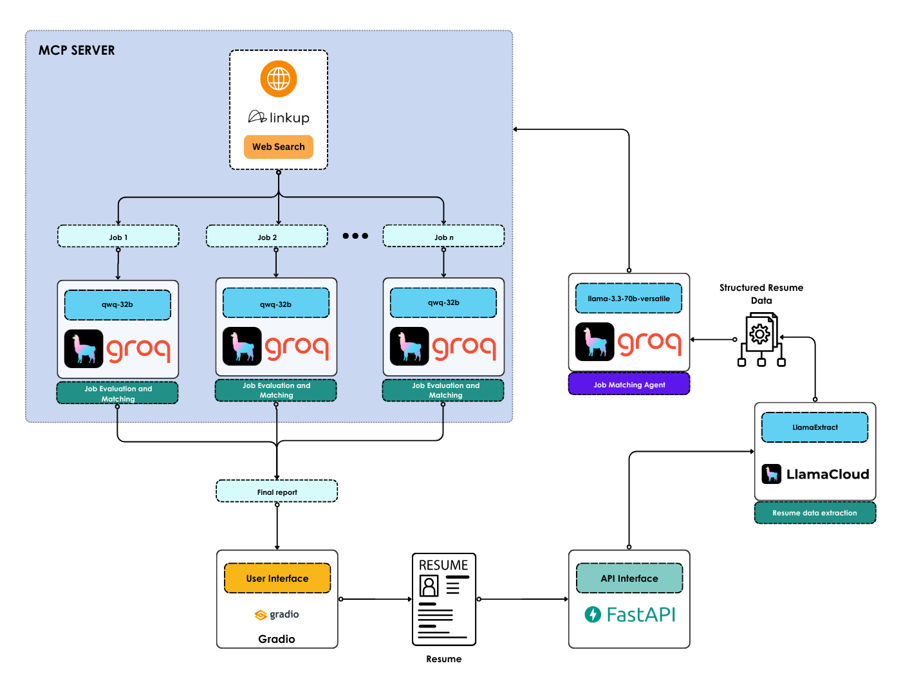

<h1 align='center'>Resume Matcher</h1>
<h2 align='center'>Match your resume with a job, effortlessly</h2>

<div align="center">
    <h3>If you find Resume Matcher useful, please consider to donate and support the project:</h3>
    <a href="https://github.com/sponsors/AstraBert"></a>
</div>
<br>
<div align="center">
    
</div>
<br>

Resume Matcher is your a friendly tool to match your resume with the latest job openings on the market, powered by [Groq](https://groq.com), [LinkUp](https://linkup.so), [LlamaIndex](https://www.llamaindex.ai), [Gradio](https://gradio.app) and [FastAPI](https://fastapi.tiangolo.com)

## Install and launch🚀

> _Required: [Docker](https://docs.docker.com/desktop/) and [docker compose](https://docs.docker.com/compose/)_

The first step, common to both the Docker and the source code setup approaches, is to clone the repository and access it:

```bash
git clone https://github.com/AstraBert/resume-matcher.git
cd resume-matcher
```

Once there, you can follow this approach

- Add the `groq_api_key`, `linkup_api_key`and `llamacloud_api_key` variable in the [`.env.example`](./.env.example) file and modify the name of the file to `.env`. Get these keys:
    + [On Groq Console](https://console.groq.com/keys)
    + [On Linkup Dashboard](https://app.linkup.so/api-keys)
    + [On LlamaCloud Dashboard](https://cloud.llamaindex.ai/)

```bash
mv .env.example .env
```

- Create an extraction agent on LlamaCloud with the following schema, and name it `resume-parser`:

```json
{
  "additionalProperties": false,
  "properties": {
    "potential_job_titles": {
      "description": "Potential job titles matching the experiences and the skills in the resume",
      "items": {
        "anyOf": [
          {
            "type": "string"
          },
          {
            "type": "null"
          }
        ]
      },
      "type": "array"
    },
    "seniority": {
      "description": "Seniority, based on years of experience. Must be one of: 'entry level', 'junior', 'mid-level', 'senior'",
      "type": "string"
    },
    "skills": {
      "description": "Skills reported in the resume",
      "items": {
        "anyOf": [
          {
            "type": "string"
          },
          {
            "type": "null"
          }
        ]
      },
      "type": "array"
    },
    "based_in": {
      "anyOf": [
        {
          "description": "Where the person is based in the World, if available",
          "type": "string"
        },
        {
          "type": "null"
        }
      ],
      "description": "Where the person is based in the World, if available"
    },
    "work_location": {
      "anyOf": [
        {
          "description": "Location where the person is available to work. Must be one of: 'remote', 'hybrid', 'on site', a combination of these options or None, if the information is not available",
          "type": "string"
        },
        {
          "type": "null"
        }
      ],
      "description": "Location where the person is available to work. Must be one of: 'remote', 'hybrid', 'on site', a combination of these options or None, if the information is not available"
    }
  },
  "required": [
    "potential_job_titles",
    "seniority",
    "skills",
    "based_in",
    "work_location"
  ],
  "type": "object"
}
```

- And now launch the docker containers:

```bash
docker compose up -f compose.local.yaml mcp_server -d
docker compose up -f compose.local.yaml app -d
```

You will see the application running on http://localhost:7500 and you will be able to use it. Depending on your connection and on your hardware, the set up might take some time (up to 15 mins to set up) - but this is only for the first time your run it!

## How it works

### Workflow



- When you upload your resume, the `resume-parser` agent will parse your resume and extract structured data from it
- The resume data are then passed on to the Job Matching Agent, which will turn them into a query to search the web for the top 5 latest job postings
- The web search is processed via LinkUp and the results are returned in a structured format
- Each of the jobs resulting from the web search is evaluated too see how much it matches the candidate profile
- Once the agent gathered all the information, it writes the final response and it returns it to the user

## Contributing

Contributions are always welcome! Follow the contributions guidelines reported [here](CONTRIBUTING.md).

## License and rights of usage

The software is provided under MIT [license](./LICENSE).
